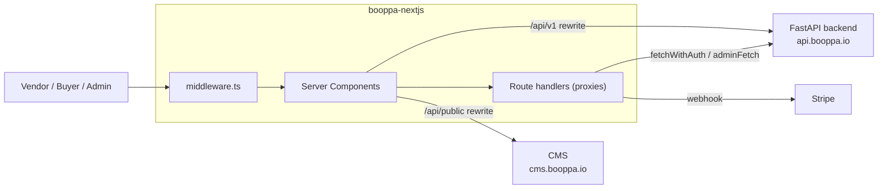
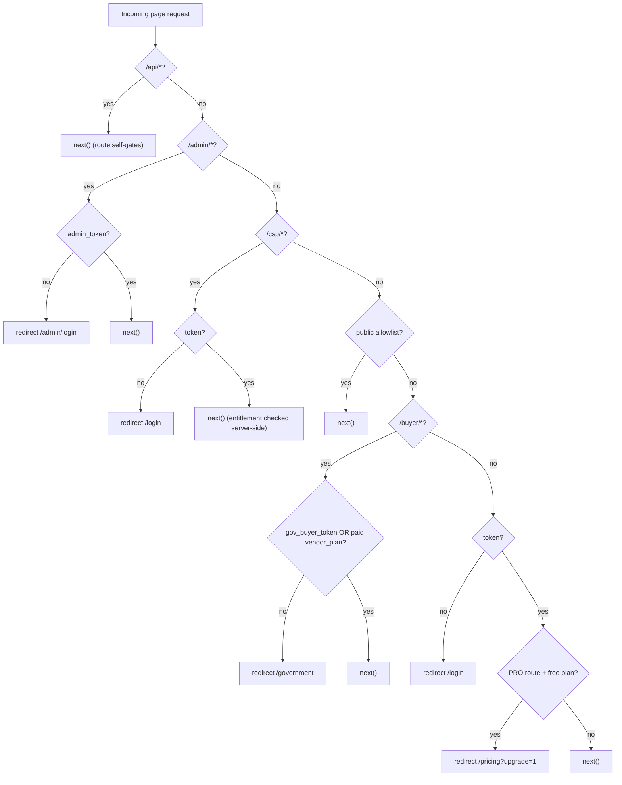
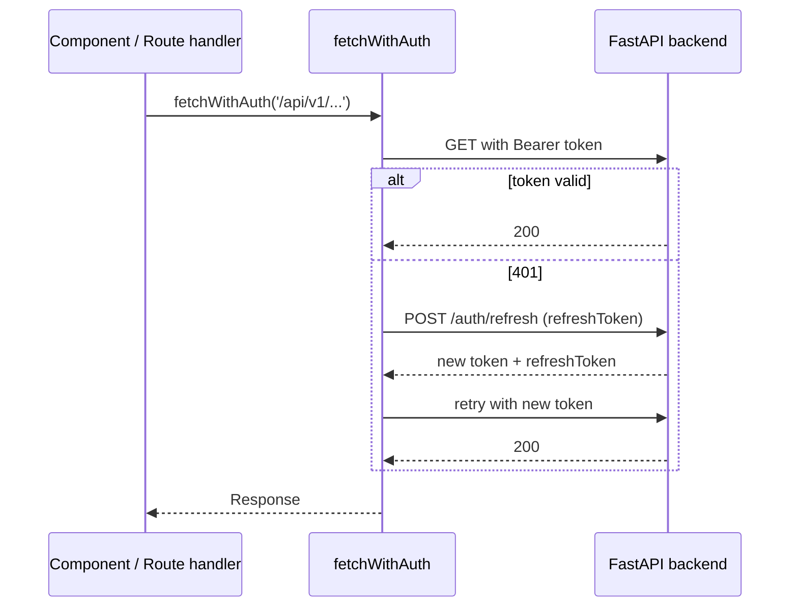
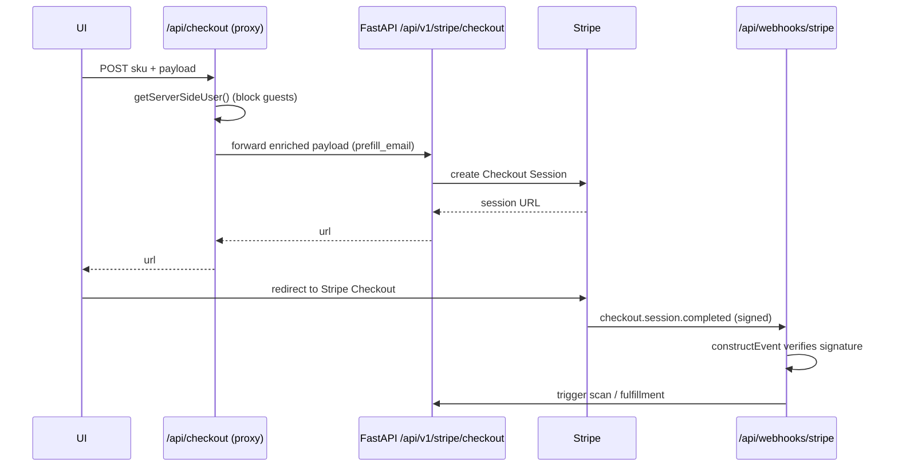

# Architecture

How the Booppa frontend is put together, and why it is shaped the way it is.

## System context

This is one of three services. The frontend renders the product and controls access; the FastAPI backend owns all business logic, data, scoring, payments, and the blockchain-anchored audit trail; a separate CMS serves marketing and educational content.

## Architectural style: a thin shell over a service

The dominant decision is that this repository holds almost no business logic. Three mechanisms carry delegation:

1. **Rewrites.** `next.config.js` maps `/api/v1/:path*` to `${BACKEND_BASE_URL}/api/v1/:path*` and `/api/public/:path*` to the CMS. Client code calls the versioned API directly and it transparently reaches FastAPI. There are also two explicit rewrites for `/api/admin/intelligence`.
2. **Proxy route handlers.** Handlers under `app/api/*/route.ts` (113 of them) attach the caller's credentials with `fetchWithAuth` and forward to the backend, re-emitting the response. `app/api/checkout/route.ts` is the reference implementation: it requires a signed-in user, enriches the payload with the user's email, then forwards to `/api/v1/stripe/checkout`.
3. **Centralized config.** `lib/config.ts` holds `apiUrl`, `wsUrl`, and an `endpoints` map. Paths are named there rather than hardcoded at call sites.

The consequence: adding a feature is usually a proxy route plus UI, because the backend already owns the endpoint. That keeps the two systems from disagreeing about business rules.

## The authentication boundary

`middleware.ts` is the single page-level gate. API routes gate themselves, so middleware returns early for anything under `/api`. Everything else is classified into one of four zones.

Notes that matter for correctness:

- **Public routes are an allowlist**, not a denylist. `publicRoutes` and `publicPrefixes` in `middleware.ts` enumerate what is open; anything else under a protected path falls through to `/login`. This fails closed.
- **`/csp` is deliberately not folded into the prefix-matched public routes.** A `startsWith('/csp')` match would wrongly expose `/csp/dashboard`. The marketing page is matched exactly; the operational app is gated separately. The CSP entitlement (an active paid org) is a different axis from `vendor_plan` and is enforced server-side by the backend returning 402, not in middleware.
- **The PRO paywall reads a signed cookie.** `vendor_plan` is verified through `verifyAndParseCookieValue` before it is trusted.

## Auth fetch helpers

Three helpers cover the server-side call paths:

- `fetchWithAuth(path, init)` (`lib/auth.ts`): for user-facing pages and their route handlers. Takes the backend path, attaches the `token` cookie as a bearer, and on a 401 refreshes via `/auth/refresh` and retries once.
- `adminFetch(path, init)` (`lib/adminFetch.ts`): same shape for `/admin/*`, forwarding `admin_token`.
- `getServerSideUser()`: resolves the current user from the `token` cookie (with a refresh fallback), used to gate guest access in route handlers such as checkout.

## Checkout and fulfillment

Payment is a multi-service flow. The frontend proxy enforces sign-in, the backend creates the Stripe session, and fulfillment is triggered by webhook.

The webhook route verifies the `stripe-signature` header with `stripe.webhooks.constructEvent` and rejects on failure before any side effect. Fulfillment side effects (for example the PDPA scan pipeline) are keyed off event metadata.

## Pricing is duplicated by design

`lib/pricing.ts` is the frontend source of truth for product names, prices, and feature bullets (`ONE_TIME_PRODUCTS`, `BUNDLE_PRODUCTS`, `SUBSCRIPTION_PRODUCTS`, `ALL_PRODUCTS`). Its header states the contract explicitly: prices here must match `app/services/pricing.py` on the backend. A price, SKU id, or new product is a two-repository change plus the matching `STRIPE_*` price ID env var. This is a conscious trade-off, discussed in [TRADEOFFS.md](TRADEOFFS.md).

## Content security and headers

`next.config.js` ships a hand-rolled CSP alongside HSTS, `X-Content-Type-Options: nosniff`, `X-Frame-Options: SAMEORIGIN`, a referrer policy, and a `Permissions-Policy` that disables camera, microphone, geolocation, and FLoC. The CSP allowlist names each permitted origin (`api.booppa.io`, `cms.booppa.io`, Calendly, polygonscan.com, Cloudflare Insights, and the staging IP). A new third-party origin requires editing the matching `*-src` directive, or the browser blocks it silently.

## Conventions worth preserving

- Server Components are the default; Client Components declare `'use client'`.
- Route handlers that touch cookies set `export const dynamic = 'force-dynamic'`.
- Some older files (notably `lib/auth.ts`) carry Italian comments. They are preserved on edit rather than translated as part of unrelated work.
- Shared components live in `components/`; feature components live under their `app/<route>/` folder.
