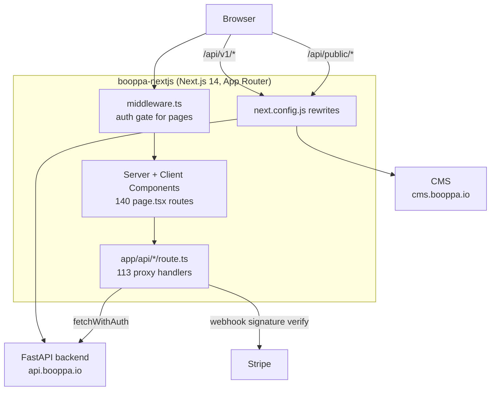

# Booppa Frontend (booppa-nextjs)

The web application for Booppa, a compliance and procurement-readiness SaaS for vendors and government buyers in Singapore. This repository is the Next.js 14 App Router frontend. It is a deliberately thin shell that renders the product and proxies almost all dynamic work to a separate FastAPI backend ([`booppa_backend`](https://github.com/Alfred-ZinMinKhant/booppa_backend)).

## The business problem

Booppa helps vendors prove they are compliant (PDPA data protection, supply-chain and CSP/AML checks) and procurement-ready, and helps government and enterprise buyers verify that evidence. The product surface is large: marketing and education pages, a vendor dashboard, a buyer dashboard, an admin console, a CSP operations app, pricing and Stripe checkout, blockchain-anchored evidence verification, and RFP acceleration tooling.

The frontend's job is to present all of that coherently, gate each area behind the right identity, and never become a second place where business logic and data live. The backend owns the truth; this app renders it and controls access to it.

## Why this repository exists (and why it is thin)

A compliance product's rules, prices, scoring, and audit trail must have exactly one authoritative home. Splitting business logic across a frontend and a backend is how two systems drift out of agreement, and in a compliance context that drift is a correctness bug with legal weight.

So this app is built as a shell:

- Dynamic pages and API routes delegate to the FastAPI backend at `api.booppa.io`.
- Route handlers under `app/api/*/route.ts` are proxies, not real backends. They attach the caller's credentials and forward the request. `app/api/checkout/route.ts` is the canonical example.
- `next.config.js` rewrites `/api/v1/:path*` straight to the backend and `/api/public/:path*` to the CMS, so client code can call the versioned API directly.

The value this repository adds is not business logic. It is presentation, routing, and a correct, multi-zone authentication boundary.

## Architecture at a glance



See [ARCHITECTURE.md](ARCHITECTURE.md) for the auth-zone, proxy, and checkout diagrams.

## Technology stack

| Area | Choice | Notes |
|---|---|---|
| Framework | Next.js 14, App Router | Server Components by default; Client Components opt in with `'use client'` |
| Language | TypeScript 5 | Path alias `@/*` resolves to repo root |
| UI | React 18, Tailwind CSS 3, lucide-react, recharts | |
| Auth boundary | `middleware.ts` | The single page-level gate; API routes gate themselves |
| Paywall integrity | HMAC-SHA256 signed cookie (`lib/cookie-signing.ts`) | Web Crypto `crypto.subtle`, `COOKIE_SIGNING_SECRET` |
| Payments | Stripe (`stripe` SDK) | Checkout via backend; a signature-verified webhook route lives here too |
| Realtime | socket.io-client | Notifications (`components/notifications/NotificationProvider.tsx`) |
| Email | AWS SES (`@aws-sdk/client-ses`) | Transactional |
| PDF / QR | pdf-lib, qrcode | Client-side artifacts |
| Testing | Playwright e2e only | No unit-test framework; specs in `e2e/flows/` |
| Deploy | AWS Amplify | `amplify.yml`, SSR runtime |

Honest note: `rate-limiter-flexible` is listed as a dependency but is not referenced in application code (rate limiting is enforced on the backend). It is the frontend's counterpart to an unused dependency, and is called out here rather than implied to be in use.

## Authentication: four zones, one gate

`middleware.ts` is the only auth gate for pages. It recognizes distinct cookies and routes each area to its own login on failure:

| Zone | Path prefix | Credential | Behaviour |
|---|---|---|---|
| Vendor / user | `/vendor/*` and protected routes | `token` (+ `refreshToken`) | Public routes are an allowlist; anything else falls through to `/login` |
| Admin | `/admin/*` | `admin_token` | `/admin/login` always reachable; everything else requires the token |
| Government buyer | `/buyer/*` | `gov_buyer_token` or a paid `vendor_plan` | Unlocked by a buyer login or by an enterprise/buyer subscription |
| CSP app | `/csp/*` | `token` | `/csp` marketing page is public; the operational app requires sign-in, and the CSP entitlement is enforced server-side by the backend, not in middleware |

Two additional rules matter:

- PRO-gated routes (`/vendor/evidence`, `/vendor/rfp`) read the `vendor_plan` cookie and bounce free plans to `/pricing?upgrade=1`.
- `vendor_plan` is HMAC-signed and must be read through `verifyAndParseCookieValue`. A raw cookie value is untrusted, so the paywall cannot be lifted by editing a cookie.

Full detail and the residual risks are in [SECURITY.md](SECURITY.md).

## Security highlights

- Strict, hand-rolled Content-Security-Policy plus HSTS, `X-Content-Type-Options`, `X-Frame-Options`, and a locked-down `Permissions-Policy` in `next.config.js`. Adding a third-party origin means editing the matching directive, or the request is blocked in the browser.
- Auth cookies are `httpOnly`, `sameSite: lax`, and `secure` in production (`lib/auth.ts`).
- The paywall cookie is tamper-evident by HMAC signature, not by obscurity.
- The Stripe webhook route verifies the `stripe-signature` before acting.

## Local development

```bash
npm install --legacy-peer-deps   # peer-dep conflict requires the flag
npm run dev                      # http://localhost:3000
npm run build && npm start       # production build
npm run lint                     # next lint
```

`.env.example` is the authoritative environment list. Note that `NEXT_PUBLIC_MAINTENANCE_MODE` may be `true` in `.env.local`; disable it locally before testing real flows.

### Testing

Playwright end-to-end specs live in `e2e/flows/`. JWT-gated specs auto-skip when `PLAYWRIGHT_TEST_JWT` is unset, so the suite passes locally without credentials. See [TESTING.md](TESTING.md).

## API examples

Client code calls the versioned backend surface directly; the rewrite handles the hop:

```ts
// Rewritten by next.config.js to https://api.booppa.io/api/v1/marketplace/search
const res = await fetch('/api/v1/marketplace/search?q=logistics')
```

Checkout goes through the local proxy, which requires a signed-in user before forwarding to the backend:

```ts
const res = await fetch('/api/checkout', {
  method: 'POST',
  headers: { 'Content-Type': 'application/json' },
  body: JSON.stringify({ sku: 'pdpa-quick-scan', scan_url: 'https://example.com' }),
})
```

## Further reading

- [ARCHITECTURE.md](ARCHITECTURE.md): system design, auth zones, proxy pattern, checkout sequence, with diagrams
- [SECURITY.md](SECURITY.md): auth model, cookie integrity, CSP, threat model, residual risks
- [ADR.md](ADR.md): the real decisions and their consequences
- [TRADEOFFS.md](TRADEOFFS.md): the compromises worth defending out loud
- [LESSONS.md](LESSONS.md): what building this taught
- [ROADMAP.md](ROADMAP.md): where it is heading

The companion backend is documented in [`booppa_backend`](https://github.com/Alfred-ZinMinKhant/booppa_backend).
